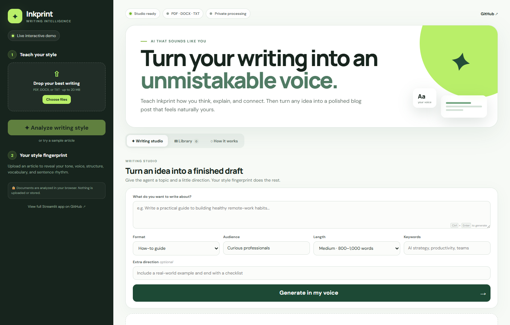
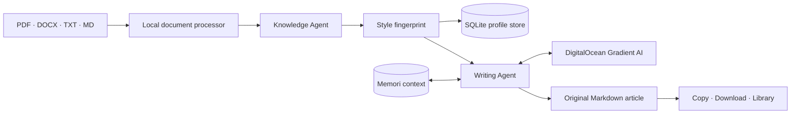

<div align="center">
  
  <h1>Inkprint · AI Blog Writing Agent</h1>
  <p><strong>Turn the writing you have already done into a voice you can keep building with.</strong></p>
  <p>
    Inkprint studies the tone, rhythm, structure, and vocabulary in your articles, creates a reusable style fingerprint,
    and writes original blog posts in that voice with DigitalOcean Gradient AI and Memori.
  </p>
  <p>
    <a href="https://tirth1263.github.io/blog-writing-agent/"><strong>Try the live interactive showcase →</strong></a>
    ·
    <a href="#quick-start">Run the full app</a>
    ·
    <a href="#deploy">Deploy your own</a>
  </p>

  [](https://tirth1263.github.io/blog-writing-agent/)
  [](https://www.python.org/)
  [](https://streamlit.io/)
  [](https://github.com/tirth1263/blog-writing-agent/actions/workflows/test.yml)
  [](LICENSE)
</div>



## Why Inkprint?

Most writing assistants can produce grammatically correct content. Far fewer can preserve the small choices that make an author recognizable: how quickly they get to the point, whether they teach through questions or examples, how long their paragraphs breathe, and how they turn an idea into a useful takeaway.

Inkprint treats those choices as a reusable writing system. Upload a few articles, inspect the resulting style fingerprint, and start creating new work without flattening your voice into generic AI copy.

## What it can do

- **Learn a writing style** from one or several PDF, DOCX, TXT, or Markdown files.
- **Analyze seven dimensions**: tone, voice, structure, vocabulary, sentence rhythm, example style, and signature traits.
- **Generate original articles** through a DigitalOcean Gradient AI agent's OpenAI-compatible endpoint.
- **Remember useful context** across AI conversations with Memori Cloud (formerly GibsonAI Memori).
- **Work without API keys** using a deterministic local analysis and demo-writing engine.
- **Keep source documents private** by extracting them in memory and never saving the original files.
- **Manage finished work** with a SQLite-backed library, Markdown copy, and Markdown/HTML downloads.
- **Deploy almost anywhere** with Streamlit, Docker, DigitalOcean App Platform, Render-style platforms, or any Python host.

## Two experiences, one project

| Experience | Best for | Processing | AI mode |
|---|---|---|---|
| [Public interactive showcase](https://tirth1263.github.io/blog-writing-agent/) | Trying the workflow instantly | Entirely in the browser; library uses `localStorage` | Local style analyzer and representative demo writer |
| Full Streamlit application (`app.py`) | Real writing and production deployment | Documents in memory; profiles/articles in SQLite | DigitalOcean Gradient AI + optional Memori, with automatic local fallback |

The public showcase deliberately does not collect API keys. The full Streamlit app supports secrets safely on the server or session-only credentials entered from its configuration panel.

## How it works



### 1. Knowledge Agent

The sidebar accepts one or more writing samples. Text extraction happens locally, then the analyzer focuses on repeatable author habits rather than subject matter. The result is a structured `StyleProfile` that can be inspected, saved, and injected into later writing prompts.

### 2. Memory layer

The app stores its own artifacts—style profiles and saved drafts—in SQLite. When `MEMORI_API_KEY` is present, Memori wraps the DigitalOcean-compatible LLM client and attributes conversations to the current writer and the `blog-writing-agent` process. That gives the AI structured, long-lived conversational context without coupling the rest of the application to one memory backend.

### 3. Writing Agent

A writing brief combines the topic, audience, format, target length, keywords, extra direction, and compact style fingerprint. The generated result is clean Markdown with a strong opening, descriptive section headings, concrete examples, and a practical conclusion.

## Project architecture

| File / directory | Responsibility |
|---|---|
| `app.py` | Streamlit UI, session state, uploads, configuration, exports, and library views |
| `agents.py` | Document extraction, local heuristics, DigitalOcean client, style analysis, and generation |
| `memory.py` | SQLite persistence and safe standalone HTML export |
| `docs/` | Privacy-first browser showcase published on GitHub Pages |
| `tests/` | Unit coverage for processing, analysis, generation, persistence, and escaping |
| `.do/app.yaml` | DigitalOcean App Platform application specification |
| `Dockerfile` | Non-root production container with a Streamlit health check |
| `.github/workflows/` | Automated quality checks and GitHub Pages deployment |

## Quick start

### Prerequisites

- Python 3.10 or newer (Python 3.12 is recommended for deployment)
- A [DigitalOcean Gradient AI agent endpoint](https://docs.digitalocean.com/products/gradient-platform/getting-started/quickstart/) and agent access key for real AI generation
- A [Memori API key](https://app.memorilabs.ai/) for long-term conversation memory (optional)
- [`uv`](https://docs.astral.sh/uv/) or `pip`

### Install with `uv` (recommended)

```bash
git clone https://github.com/tirth1263/blog-writing-agent.git
cd blog-writing-agent
uv sync
```

Create `.env` from the example:

```bash
cp .env.example .env
```

Add credentials when you are ready to use the hosted AI path:

```dotenv
DIGITAL_OCEAN_ENDPOINT=https://your-agent-id.agents.do-ai.run
DIGITAL_OCEAN_AGENT_ACCESS_KEY=your_agent_access_key
MEMORI_API_KEY=your_memori_api_key
```

Start the application:

```bash
uv run streamlit run app.py
```

Open the URL Streamlit prints (normally `http://localhost:8501`). The app also works immediately in private demo mode if the credential variables are absent.

### Install with `pip`

```bash
python -m venv .venv
```

Activate the environment:

```bash
# macOS / Linux
source .venv/bin/activate

# Windows PowerShell
.venv\Scripts\Activate.ps1
```

Then install and run:

```bash
pip install -r requirements.txt
streamlit run app.py
```

## Configuration

| Variable | Required | Purpose |
|---|---:|---|
| `DIGITAL_OCEAN_ENDPOINT` | For hosted AI | Agent endpoint copied from DigitalOcean; `/api/v1/` is added automatically |
| `DIGITAL_OCEAN_AGENT_ACCESS_KEY` | For hosted AI | Bearer key created for that agent endpoint |
| `MEMORI_API_KEY` | No | Enables Memori attribution, ingestion, and recall around LLM calls |
| `APP_USER_ID` | No | Stable identifier used to scope profiles, drafts, and Memori attribution |
| `DATABASE_PATH` | No | SQLite path; defaults to `.data/blog_agent.db` |

You can use environment variables, a `.env` file, Streamlit secrets, or the app's **Connect your own AI** panel. Values entered in the panel live only in the current Streamlit session and are never written to SQLite.

### DigitalOcean agent setup

1. Open **Agent Platform** in the DigitalOcean control panel.
2. Create or select an agent and copy its endpoint.
3. In the agent's settings, create an **Endpoint Access Key** and copy it once.
4. Set the two `DIGITAL_OCEAN_*` variables above.
5. Restart Inkprint. The sidebar badge changes from **Private demo mode** to **DigitalOcean AI connected**.

Inkprint sends non-streaming chat completions to:

```text
{DIGITAL_OCEAN_ENDPOINT}/api/v1/chat/completions
```

The key is sent as a bearer token by the OpenAI-compatible Python client. It is never exposed in generated downloads or stored in the application database.

### Memori setup

1. Create a key in the [Memori dashboard](https://app.memorilabs.ai/).
2. Set `MEMORI_API_KEY` in the same environment as the app.
3. Optionally set `APP_USER_ID` so memory attribution is stable across sessions.

When both DigitalOcean and Memori are configured, the sidebar confirms that Memori is learning from the writing session. If Memori is unavailable, the AI workflow continues without memory instead of making writing unavailable.

For teams that want their own database, Memori also documents a [GibsonAI serverless database integration](https://memorilabs.ai/docs/open-source/databases/gibsonai/).

## Deploy

### DigitalOcean App Platform

[](https://cloud.digitalocean.com/apps/new?repo=https://github.com/tirth1263/blog-writing-agent/tree/main)

The included `.do/app.yaml` installs the Python dependencies, starts Streamlit on port `8080`, and checks `/_stcore/health`. After creating the app, add `DIGITAL_OCEAN_ENDPOINT`, `DIGITAL_OCEAN_AGENT_ACCESS_KEY`, and `MEMORI_API_KEY` as encrypted environment variables. The service still starts in demo mode before secrets are added.

### Streamlit Community Cloud

1. Fork this repository.
2. In Streamlit Community Cloud, choose **Create app** and select `app.py`.
3. Open **Advanced settings → Secrets** and copy the keys from `.streamlit/secrets.toml.example`.
4. Deploy. No command override is required.

### Docker

```bash
docker build -t inkprint .
docker run --rm -p 8080:8080 --env-file .env inkprint
```

Then open `http://localhost:8080`. The image runs as an unprivileged user and includes a production health check.

### Other Python platforms

Use the included `Procfile` or this start command:

```bash
streamlit run app.py --server.address 0.0.0.0 --server.port $PORT
```

If the platform has an ephemeral filesystem, saved SQLite articles will reset when the container is replaced. Mount a persistent volume at `.data/` or point `DATABASE_PATH` to a persistent location for production use.

## Privacy and security

- Original uploads are read into memory and discarded; the app does not save source documents.
- PDF and DOCX extraction happens inside the running application, not in a third-party conversion service.
- The public showcase processes files entirely in the browser and stores saved drafts only in that browser's `localStorage`.
- Secrets are excluded by `.gitignore`, masked in the interface, and never included in exports.
- Generated HTML escapes source content before rendering it, preventing script injection in downloads.
- SQLite statements use bound parameters, and article deletes are scoped to the current user identity.
- Upload size is capped at 20 MB per file in Streamlit configuration, and analysis text is bounded before it enters a prompt.

> For a shared production deployment, add your preferred authentication provider and map each authenticated account to a stable `APP_USER_ID`/entity identifier. The included build is intentionally simple and optimized for a personal writing studio.

## Development and quality checks

Install development dependencies and run everything locally:

```bash
pip install -r requirements-dev.txt
ruff check app.py agents.py memory.py tests
pytest
```

The test suite covers:

- TXT extraction and unsupported-file validation
- Complete local style fingerprints
- Publication-ready Markdown generation in demo mode
- DigitalOcean endpoint normalization
- Profile/article persistence and deletion
- HTML export escaping

GitHub Actions runs the same lint and test checks on every push and pull request. A separate workflow publishes `docs/` to GitHub Pages.

## Example workflow

1. Upload two or three articles that represent the voice you want to keep.
2. Select **Analyze writing style** and review the fingerprint in the sidebar.
3. Enter a topic such as *“How ethical AI can improve patient care without losing human trust.”*
4. Choose the audience, article format, length, and any SEO concepts.
5. Generate, review, and edit the Markdown.
6. Copy it, download Markdown/HTML, or save it to the library.
7. Add better writing samples over time to refine the profile you use next.

## Roadmap

- [ ] Authenticated multi-writer workspaces
- [ ] Profile blending and version comparison
- [ ] Inline revision chat for selected paragraphs
- [ ] Direct publishing to CMS platforms
- [ ] Pluggable persistent databases for horizontally scaled deployments
- [ ] Editorial scoring against a saved style profile

## Contributing

Ideas, bug reports, and pull requests are welcome. Please open an issue before a large change so the direction can be discussed. Keep source documents and API keys out of commits, add tests for new behavior, and run Ruff plus pytest before submitting a pull request.

## License

Released under the [MIT License](LICENSE).

---

<div align="center">
  <strong>Built for writers who want AI to learn their choices—not erase them.</strong><br>
  DigitalOcean Gradient AI · Memori · Streamlit
</div>
